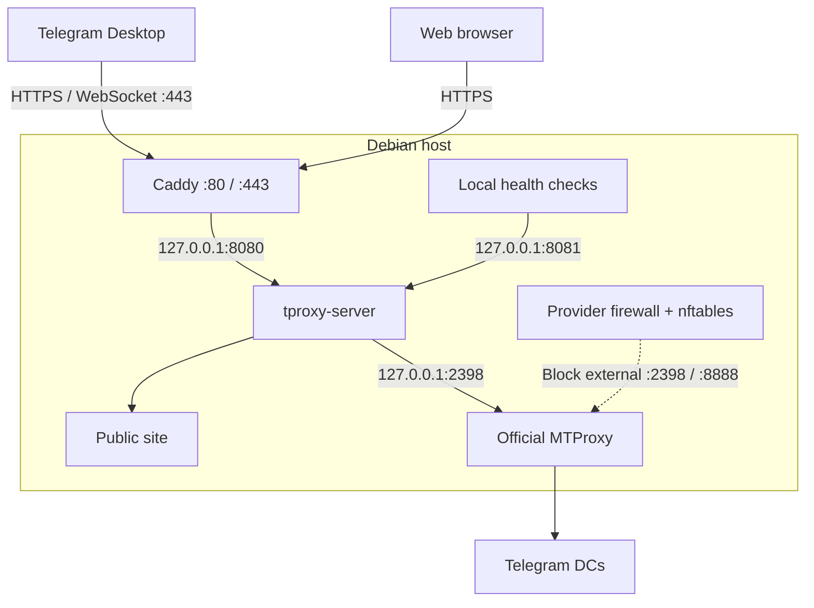

# Telegram WEB Proxy Deploy

Deploy and maintain the official Telegram WEB Proxy stack on a dedicated Debian 13 server, with guarded updates and private credentials.


[](LICENSE)

## Quick Start

In a **root Bash shell** on Debian 13 x86_64, with `curl` installed:

```bash
bash <(curl -fsSL https://raw.githubusercontent.com/OWNER/REPO/main/bootstrap.sh)
```

Enter your domain, inbound public IPv4 and ACME email. The bootstrap downloads this project's latest stable release, verifies its installer checksum and starts the interactive installer. It never prints client credentials automatically.

> [!IMPORTANT]
> This is a publication-ready source package, not a published service. Replace `OWNER/REPO` and publish the first stable release before using the one-liner. Real VPS acceptance is still required; see [validation](docs/VALIDATION.md).

## Features

- Official `telegramdesktop/tproxy-server` and `TelegramMessenger/MTProxy`, behind Caddy HTTPS.
- Latest stable upstream release, or official default-branch HEAD when no releases exist; exact installed SHA recorded.
- Fail-closed deployment compatibility checks and relay-only updates with rollback.
- Existing secrets, token key, base path and public site preserved during updates.
- Explicit adoption of the reviewed private/reference installation.
- Ownership-aware runtime removal; optional secret purge and site removal.

## Requirements

| Requirement | Detail |
|---|---|
| Host | Dedicated Debian 13, x86_64, root access, booted systemd |
| DNS | Hostname's IPv4 records resolve exclusively to the expected inbound IPv4 |
| Public ports | TCP 80 and 443, available for this dedicated Caddy deployment |
| Provider firewall | Deny inbound backend/admin ports 2398, 8888, 8080 and 8081; allow SSH as appropriate |
| Network | HTTPS access to GitHub, upstream downloads, ACME and IPv4 echo services; Telegram DC connectivity |
| Existing resources | No unrelated Caddy, matching services or backend firewall table; installation refuses conflicts |

Use a DNS-only hostname rather than a CDN proxy. Remove an incorrect AAAA record or configure its routing deliberately. IPv4 DNS validation does not prove IPv6 reachability. The installer installs missing prerequisites and upstream build dependencies; review capacity and outbound policy before deployment.

## Interactive Installation

The Quick Start asks for the three deployment values and confirmation. Missing values prompt only on a terminal. A fresh installation generates its own secret securely and creates a neutral welcome page.

After downloading a release for repeated use, run:

```bash
bash install.sh install
```

## Non-interactive Installation

```bash
bash install.sh install \
  --domain proxy.example.com \
  --ip 203.0.113.10 \
  --email admin@example.com \
  --yes
```

`--yes` approves the selected operation; it does not imply secret purge, site removal or removal of old containers. Missing required values fail immediately.

## How It Works

Caddy terminates HTTPS. The relay serves the public website and authenticated WebSocket carrier traffic, forwarding proxy traffic to the official MTProxy backend. Relay/admin sockets bind to loopback. MTProxy's upstream reference service listens on wildcard backend ports; a dedicated nftables rule and the provider firewall protect them.

### Architecture



## Commands

| Command | Purpose | Additional options |
|---|---|---|
| `install` | Fresh installation or validated no-op | `--domain`, `--ip`, `--email`, `--site-dir`, `--adopt`, `--remove-obsolete`, `--upstream-ref`, `--yes` |
| `update` | Update relay only | `--upstream-ref`, `--yes` |
| `status` | Health, services, firewall and version information | None required |
| `show-link` | Explicitly print both private WEB Proxy links | None required |
| `uninstall` | Remove owned runtime | `--purge`, `--remove-site`, `--yes` |
| `help` | Offline usage; no root required | None |

Operational commands require root. The bootstrap forwards arguments, so the Quick Start command can be followed by `status`, `show-link`, or other command arguments. Keep a verified installer locally for offline help and recovery.

## Update

```bash
bash install.sh update --yes
```

The wrapper validates the deployment, obtains upstream's latest stable release or default HEAD, checks the deployment contract, then invokes the reviewed upstream relay updater. It tests/builds the candidate, preserves operator files, waits for health/readiness and verifies HTTPS/firewall protection before recording the new SHA. The old binary and metadata remain in root-only backups under `/var/lib/tproxy-installer/backups/`.

If activation or verification fails, the exit trap restores the previous binary and metadata and checks local health/readiness. Rollback failure is reported explicitly. This is binary rollback, not a filesystem or host snapshot. Updates do not refresh Caddy, MTProxy or their pinned dependencies.

A matching SHA reports **Already up to date**. A changed deployment contract stops the update; no silent fallback to an older commit occurs. A newer reviewed wrapper release is required to accept the changed contract. For deliberate reproducibility, `--upstream-ref` accepts a full 40-character SHA or official tag. See [operations](docs/OPERATIONS.md).

## Status

```bash
bash install.sh status
```

Shows installed project version/SHA, latest upstream SHA/label, carrier mode, service states, health, readiness, HTTPS, backend protection, local source and measured egress IPv4. It does not print secrets. A failed latest-version lookup does not erase local status. The exit code reflects endpoint/TLS/firewall checks; inspect displayed service states too.

## Show Link

```bash
bash install.sh show-link
```

Prints `https://t.me/webproxy?...` and `tg://webproxy?...` using the installed secret and base path. Treat both links as credentials. Base-path links use upstream's `0x70` marked, unpadded base64url secret encoding; root-path links retain the original secret.

## Uninstall

```bash
bash install.sh uninstall
```

Displays the removal plan, offers separate optional purge/site choices and asks for confirmation. In automation:

```bash
bash install.sh uninstall --yes
# Explicitly remove owned private configuration as well:
bash install.sh uninstall --purge --yes
```

| Resource | Default | With explicit option |
|---|---|---|
| Owned services, relay/backend binaries, dedicated Caddy integration | Removed | Same |
| Private config, profiles and token key | Kept | `--purge` removes unchanged owned files |
| Public site | Kept | `--remove-site` only when created by this wrapper |
| Backups, users, packages, Go toolchain, MTProxy source/build tree | Kept | Manual review |
| Caddy ACME storage and refreshed Telegram DC list | Kept | Manual review |
| Unrelated Docker, systemd, Caddy and nftables resources | Preserved | Conflicts stop removal |

Changed files or ambiguous ownership stop automated removal. Adopted/existing sites are never automatically deleted. Retained backups may contain private state; purge is not secure erasure. See recovery notes before reinstalling after removal.

## Security

Secrets are private by default, checked for restrictive permissions and supplied to the fresh upstream installer through stdin. Root-only non-secret metadata records ownership and exact revisions. Both wrapper and upstream-update locks prevent concurrent changes. No persistent installer transcript is created.

> [!WARNING]
> A provider firewall is required. The upstream nftables reload sequence deletes then recreates its table, leaving a short host-firewall gap. The wrapper propagates nftables reloads to the backend service but does not remove that gap.

Read [SECURITY.md](SECURITY.md) for the trust model, disclosure and remote bootstrap limits. This tool cannot protect a compromised root account. Do not enable shell tracing or paste service logs without redacting credentials.

## Public Site

Use `--site-dir /absolute/path/to/site` with a regular `index.html` for a fresh installation. Existing `/srv/tproxy-site` content wins and is preserved. Without a supplied site, the wrapper creates a small neutral domain welcome page with no proxy branding. Use a root-owned, trusted static directory; do not include private files or symlinks to private locations. Adoption and update never replace the site.

## NAT Notes

The inbound DNS IPv4 and outbound egress IPv4 are separate facts. The wrapper measures route source and egress independently and refuses a DNS-based NAT fallback. A changed NAT mapping blocks updates until reviewed. Echo-service results cannot prove that Telegram traffic follows the same path; multi-WAN, destination-specific NAT and unusual provider routing require real client acceptance.

## Adoption of the Reference Deployment

```bash
bash install.sh install --adopt \
  --domain proxy.example.com --ip 203.0.113.10 \
  --email admin@example.com --yes
```

Requires the private wrapper's `/var/lib/tproxy-installer/upstream.commit`, valid token key, matching reference units/Caddy/firewall, current NAT mapping and a healthy stack. It preserves secrets, token bytes, base path and site. If necessary it changes only the profile's carrier to `websocket`, with a rollback copy. Customized or incomplete deployments stop for manual review. Do not manufacture provenance or delete working configuration to bypass adoption checks.

## Troubleshooting

| Symptom | Check |
|---|---|
| DNS validation fails | A records must match `--ip` exclusively; check local resolver |
| HTTPS does not become ready | Port 80/443 forwarding, provider firewall, AAAA, ACME and Caddy journal |
| Health succeeds, readiness fails | MTProxy connectivity, secret consistency and measured NAT mapping |
| Compatibility refusal | A new upstream deployment contract needs wrapper maintainer review |
| Ownership refusal | Compare the changed path and service overrides; do not overwrite metadata blindly |
| Partial installation or rollback failure | Preserve canonical files and backups; follow [recovery](docs/OPERATIONS.md) |

Diagnostics such as `systemctl status` and `journalctl` can expose MTProxy arguments or environment values. Inspect locally and redact before sharing.

## Testing / Development

The 30 original regression cases remain, supplemented by public CLI, lifecycle, resolver, rollback, ownership, bootstrap and hygiene tests. CI pins action revisions, Bats and formatting/lint tool versions. A separate job tests the audited upstream Go source; it is not a VPS integration test.

See [validation](docs/VALIDATION.md) for exact local results and the acceptance checklist. See [releasing](docs/RELEASING.md) for checksummed releases and an inspect-before-execute method.

## Upstream Relationship

Independent deployment helper; not affiliated with or endorsed by Telegram. Runtime sources are fetched from [tproxy-server](https://github.com/telegramdesktop/tproxy-server) and [MTProxy](https://github.com/TelegramMessenger/MTProxy). The wrapper preserves upstream dependency pins/checksums and does not bundle their implementation.

## License

Original wrapper, tests and documentation: [MIT](LICENSE). Components fetched at deployment retain their own terms. At the reviewed revision, tproxy-server has no repository-level license file; no permission to redistribute its implementation is inferred. See [third-party notices](THIRD_PARTY_NOTICES.md).

## Disclaimer

Operate only on infrastructure you administer and in accordance with applicable service terms and laws. No availability, anonymity or resistance to blocking is guaranteed. Complete real VPS acceptance before relying on the deployment.
