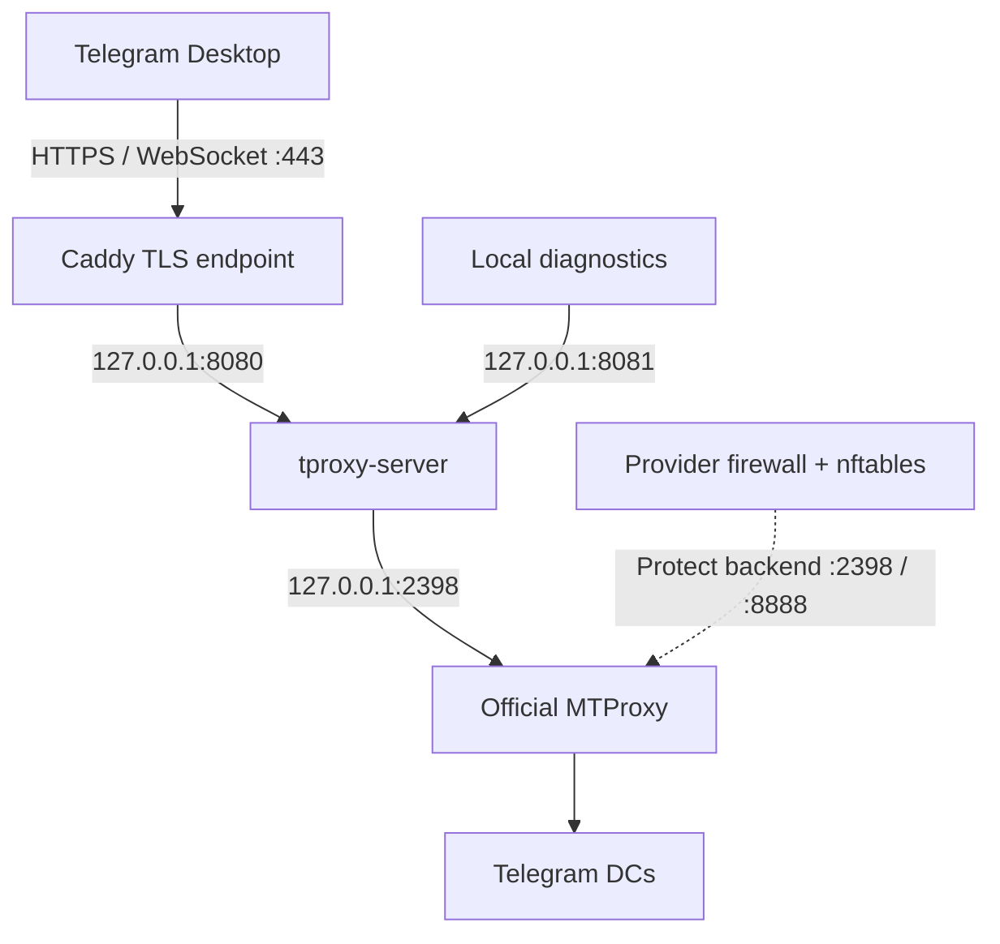

# TProxyKit

TProxyKit helps a Debian 13 administrator deploy and maintain the official Telegram WEB Proxy stack on a dedicated server. It handles installation, relay updates, health checks and conservative removal while preserving existing credentials and operator content.

It is an independent deployment helper, not an official Telegram project or a hosted proxy service.

## Start here

1. Read [Getting Started](Getting-Started) for prerequisites and the current installation route.
2. Use [Commands](Commands) for daily operations.
3. Keep [Updates & Recovery](Updates-and-Recovery) and [Troubleshooting](Troubleshooting) available before changing a working server.

> [!IMPORTANT]
> At the documentation snapshot on 2026-10-07, the repository bootstrap still has an unset repository identity and no latest stable installer release is available. The one-line installation is not ready. [Getting Started](Getting-Started) explains the available source-file route.

## The stack

Telegram WEB Proxy is a distinct client-facing proxy type using WEB Proxy links and an HTTPS carrier. A classic MTProto proxy exposes a different client connection interface. Having WebSocket somewhere inside another proxy does not make it a Telegram WEB Proxy. TProxyKit uses official MTProxy as the backend behind the WEB relay.

## Explore

| Topic | Read next |
|---|---|
| Components, traffic flow and NAT | [How It Works](How-It-Works) |
| Installation and command options | [Getting Started](Getting-Started), [Commands](Commands) |
| Version selection, adoption and recovery | [Updates & Recovery](Updates-and-Recovery) |
| Removal and retained files | [Uninstall & Cleanup](Uninstall-and-Cleanup) |
| Credentials and trust boundaries | [Security](Security) |
| Common questions and failures | [FAQ](FAQ), [Troubleshooting](Troubleshooting) |

[Main repository](https://github.com/Vladercool/TProxyKit) · [README](https://github.com/Vladercool/TProxyKit/blob/main/README.md)

This Wiki describes repository revision [`8a90272`](https://github.com/Vladercool/TProxyKit/tree/8a902721f02a88924b8fb52fe3a85134d7c70607). It documents existing behavior; it does not add a new deployment or security certification.
