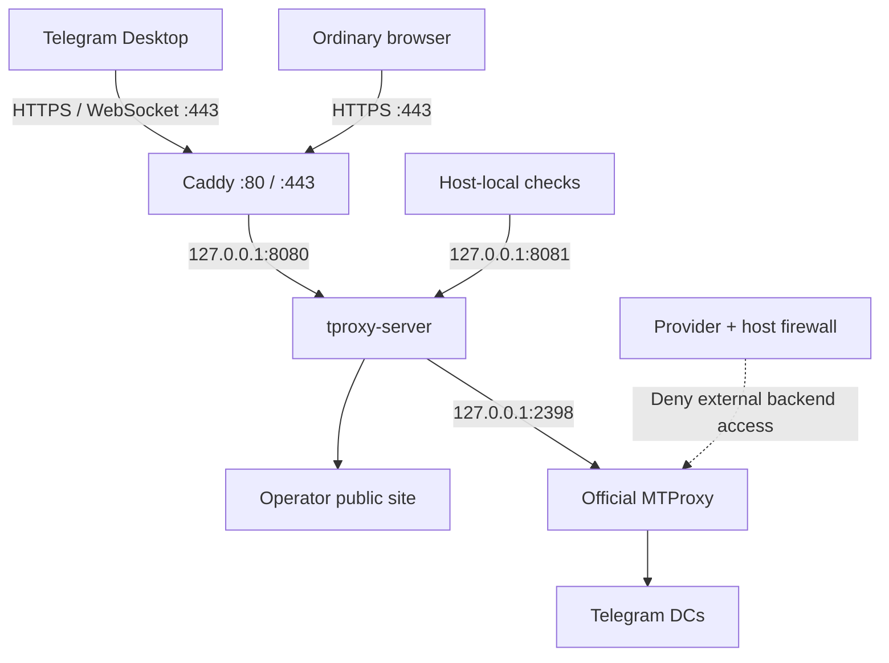

# How It Works

## Three different concepts

| Term | Meaning in this project |
|---|---|
| Telegram WEB Proxy | Client-facing WEB Proxy connection through the HTTPS relay, with `t.me/webproxy` / `tg://webproxy` links |
| Classic MTProto proxy | A different client-facing MTProto proxy connection; not the public interface provided here |
| WebSocket-based proxy | A transport description alone; it does not establish compatibility with Telegram WEB Proxy |

TProxyKit selects `carrier_mode=websocket` in the relay profile. Official MTProxy still performs the backend connection to Telegram.

## Components and boundaries

| Component | Responsibility |
|---|---|
| Caddy | Public HTTP/HTTPS endpoint, certificate handling and TLS termination |
| tproxy-server | WEB carrier relay and public website; proxy traffic goes to the local backend |
| Official MTProxy | Backend connection to Telegram DCs |
| systemd | Services, startup ordering and relay credential delivery |
| nftables | Dedicated host rule blocking external backend access |
| Provider firewall | Independent external boundary, required even with host rules |

Public TCP 80 supports Caddy's HTTP/certificate flow; clients use HTTPS on 443. The relay binds to `127.0.0.1:8080`. Its admin endpoints on `127.0.0.1:8081` include `/healthz` and `/readyz`.

MTProxy's reference deployment has wildcard backend listeners on 2398 and 8888. Port 2398 carries relay-to-backend traffic; 8888 is the backend statistics HTTP listener. They are not public service ports. Keep 8080/8081 blocked externally too. See [Security](Security).

## NAT: three addresses, three roles

| Address | Purpose |
|---|---|
| Inbound public IPv4 | What DNS and clients use to reach Caddy; supplied with `--ip` |
| Local route source IPv4 | The host-side source address selected for the Telegram route |
| Measured egress IPv4 | The public address reported by outbound HTTPS echo probes |

A provider may map inbound and outbound traffic differently. The DNS A record therefore cannot safely substitute for the backend's outbound identity. TProxyKit measures route source and egress separately, rejects failed egress discovery and validates existing NAT settings against the current measurement.

Different inbound and outbound addresses are not automatically an error. Destination-dependent NAT or multi-WAN routing still needs real Telegram client testing: an HTTPS echo service cannot prove what Telegram sees.

## Design choices

- **Official upstream first:** reuse the official deployment and relay updater, including their dependency pins.
- **Fail closed:** incompatible deployment files, unexpected ownership or invalid state stop automation.
- **Preserve operator state:** ordinary updates retain the secret, token key, base path, configuration and public site.
- **Record exact revisions:** select current official upstream dynamically, then record the exact installed SHA.
- **Bound recovery:** failed relay activation has binary rollback; it is not a host snapshot.
- **Remove only established resources:** uninstall relies on recorded paths/hashes and current integration checks.

“Latest compatible” means the selected latest revision must pass the contract gate. The installer does not search backward for an older compatible release. Continue with [Updates & Recovery](Updates-and-Recovery).
